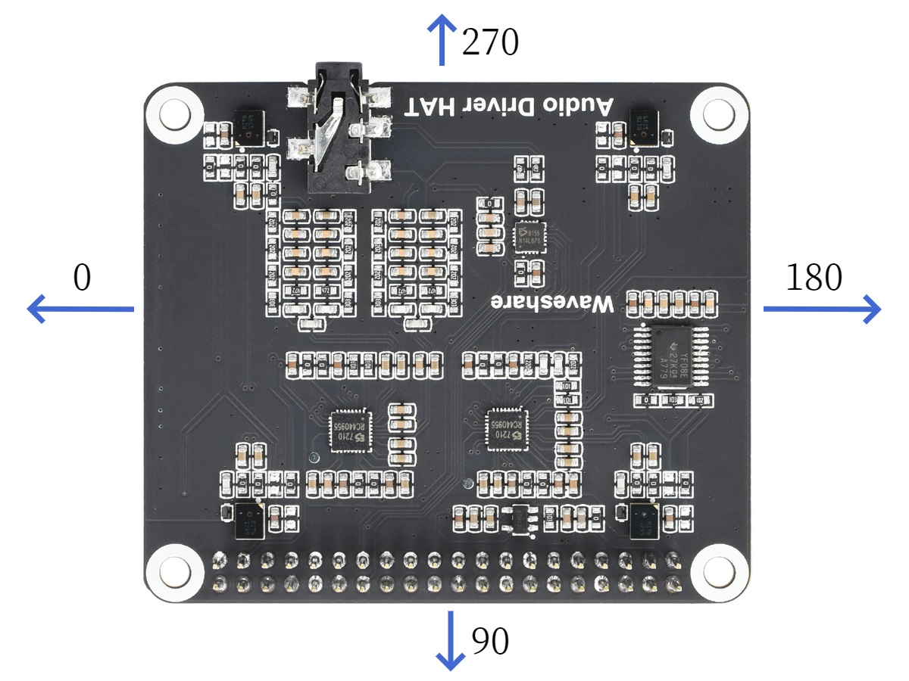
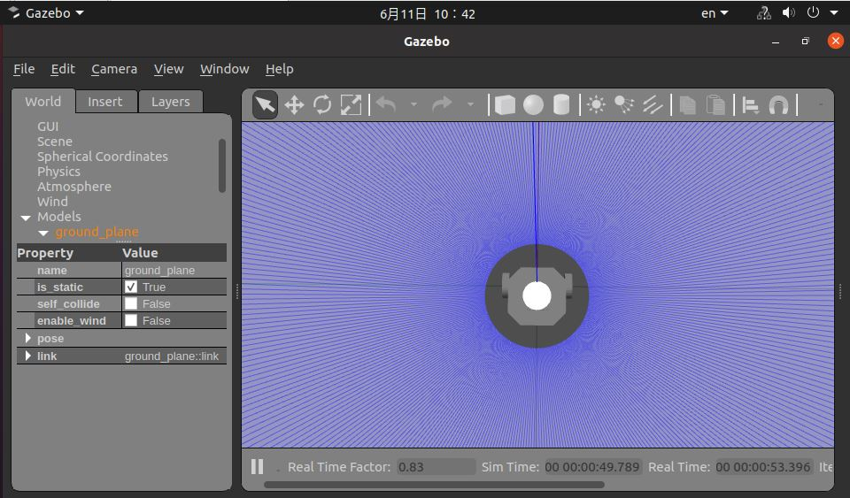

# 功能介绍

语音追踪控制小车运动功能根据声源定位的DOA角度信息控制机器人转向声源方向，并且控制机器人向前移动。此功能需要搭配地平线机器人操作系统的智能语音模块一起使用。当用户说出智能语音识别模块配置的唤醒词唤醒设备之后，语音追踪控制小车功能会激活，后续用户说出唤醒词或者配置的命令词，智能语音识别模块会输出声源的DOA角度信息，此模块收到DOA角度信息之后会控制消息转向声源方向，并且前进一定距离。

流程如下图：


APP可以使用PC端Gazebo仿真环境下的虚拟小车运行，也可以直接用于控制实物小车。

智能语音功能输出的声源定位DOA角度信息，单位为角度，支持环形麦克风阵列，环形麦克风阵列角度范围为0度~360度。麦克风角度的相对位置关系与麦克风的安装位置强相关，实际角度示意图如下：

环形麦克风：



# 机器人实物

## 物料清单

以下机器人均已适配RDK X3

| 机器人名称          | 生产厂家 | 参考链接                                                                                                                                                          |
| :------------------ | -------- | ----------------------------------------------------------------------------------------------------------------------------------------------------------------- |
| OriginBot智能机器人 | 古月居   | [点击跳转](https://www.originbot.org/)                                                                                                                            |
| X3派机器人          | 轮趣科技 | [点击跳转](https://item.taobao.com/item.htm?spm=a230r.1.14.17.55e556912LPGGx&id=676436236906&ns=1&abbucket=12#detail)                                             |
| 履带智能车          | 微雪电子 | [点击跳转](https://detail.tmall.com/item.htm?abbucket=9&id=696078152772&rn=4d81bea40d392509d4a5153fb2c65a35&spm=a1z10.5-b-s.w4011-22714387486.159.12d33742lJtqRk) |
| RDK X3 Robot        | 亚博智能 | [点击跳转](https://detail.tmall.com/item.htm?id=726857243156&scene=taobao_shop&spm=a1z10.1-b-s.w5003-22651379998.21.421044e12Yqrjm)                               |
| 麦克风板            | 微雪电子 | [点击跳转](https://www.waveshare.net/shop/Audio-Driver-HAT.htm)                                                                                                   |

## 使用方法

### 准备工作

1. 机器人具备运动底盘、相机、环形麦克风板及RDK套件，硬件已经连接并测试完毕；
2. 已有ROS底层驱动，机器人可接收“/cmd_vel”指令运动，并根据指令正确运动。

### 机器人组装

以下操作过程以OriginBot为例，满足条件的其他机器人使用方法类似。参考机器人官网的[使用指引](https://www.originbot.org/guide/quick_guide/)，完成机器人的硬件组装、镜像烧写及示例运行，确认机器人的基础功能可以顺利运行。

### 安装功能包

**1.参考[OriginBot说明](https://github.com/nodehubs/originbot_minimal/blob/develop/README.md)，完成OriginBot基础功能安装**

**2.安装功能包**

启动机器人后，通过终端SSH或者VNC连接机器人，复制如下命令在RDK的系统上运行，完成相关Node的安装。

```bash
sudo apt update
sudo apt install -y tros-audio-tracking
```

### 运行功能

运行语音追踪功能后，语音追踪控制模块会接收从智能语音功能模块发布的智能语音消息结果，并且解析消息，根据消息中的唤醒事件以及DOA角度信息发布控制小车转向某个方向特定角度的指令，当小车转向特定角度之后，继续控制小车前进一定距离（此模块默认控制小车前进0.2米的距离）。

**1.启动机器人底盘**

启动机器人，如OriginBot的启动命令如下：

```bash
source /opt/tros/setup.bash
ros2 launch originbot_base robot.launch.py 
```

**2.启动语音控制**

启动一个新的终端，通过如下指令启动功能：

```shell
# 配置tros.n环境
source /opt/tros/setup.bash

# 从地平线RDK的安装路径中拷贝出运行示例需要的配置文件。
cp -r /opt/tros/${TROS_DISTRO}/lib/hobot_audio/config/ .

# 屏蔽调式打印信息
export GLOG_minloglevel=3

# 启动launch文件，指定小车正前方的语音DOA角度，以180为例
ros2 launch audio_tracking audio_tracking.launch.py car_front_audio_angle:=180
```

启动成功后，在机器人和mic板前发出设备唤醒词“地平线你好”，语音追踪控制模块接收到唤醒事件之后接收到DOA角度信息转动小车位置，然后"向前走"、"向后退"、"向右转"、"向左转"控制小车前后左右移动。

# Gazebo仿真

Gazebo仿真适用于持有RDK X3但没有机器人实物的开发者体验功能。

## 物料清单

| 机器人名称 | 生产厂家 | 参考链接                                                        |
| :--------- | -------- | --------------------------------------------------------------- |
| RDK X3     | 多厂家   | [点击跳转](https://developer.horizon.cc/sunrise)                |
| 麦克风板   | 微雪电子 | [点击跳转](https://www.waveshare.net/shop/Audio-Driver-HAT.htm) |

## 使用方法

### 准备工作

1. 开发者有RDK套件实物，及配套的麦克风板;
2. PC电脑端已经完成ROS Gazebo及Turtlebot机器人相关功能包安装;
3. 和地平线RDK在同一网段（有线或者连接同一无线网，IP地址前三段需保持一致）的PC，PC端需要安装的环境包括：

- Ubuntu 20.04系统

- [ROS2 Foxy桌面版](https://docs.ros.org/en/foxy/Installation/Ubuntu-Install-Debians.html)

- Gazebo和Turtlebot3相关的功能包，安装方法：

  ```shell
  sudo apt-get install ros-foxy-gazebo-*
  sudo apt install ros-foxy-turtlebot3
  sudo apt install ros-foxy-turtlebot3-simulations
  ```

### 安装功能包

启动RDK X3后，通过终端SSH或者VNC连接机器人，复制如下命令在RDK的系统上运行，完成相关Node的安装。

```bash
sudo apt update
sudo apt install -y tros-audio-tracking
```

### 运行功能

运行语音追踪功能后，语音追踪控制模块会接收从智能语音功能模块发布的智能语音消息结果，并且解析消息，根据消息中的唤醒事件以及DOA角度信息发布控制小车转向某个方向特定角度的指令，当小车转向特定角度之后，继续控制小车前进一定距离（此模块默认控制小车前进0.2米的距离）。

**1.启动仿真环境及机器人**

在PC端Ubuntu的终端中使用如下命令启动Gazebo，并加载机器人模型：

```shell
source /opt/ros/foxy/setup.bash
export TURTLEBOT3_MODEL=burger
ros2 launch turtlebot3_gazebo empty_world.launch.py
```

启动成功后，仿真环境中小车效果如下：



**2.启动语音控制**

启动一个新的终端，通过如下指令启动功能：

```shell
# 配置tros.n环境
source /opt/tros/setup.bash

# 从地平线RDK的安装路径中拷贝出运行示例需要的配置文件。
cp -r /opt/tros/${TROS_DISTRO}/lib/hobot_audio/config/ .

# 屏蔽调式打印信息
export GLOG_minloglevel=3

# 启动launch文件，指定小车正前方的语音DOA角度，以180为例
ros2 launch audio_tracking audio_tracking.launch.py car_front_audio_angle:=180
```

启动成功后，在机器人和mic板前发出设备唤醒词“地平线你好”，语音追踪控制模块接收到唤醒事件之后接收到DOA角度信息转动小车位置，然后"向前走"、"向后退"、"向右转"、"向左转"控制小车前后左右移动。

# 接口说明

## 话题

| 名称     | 消息类型                | 说明                         |
| -------- | ----------------------- | ---------------------------- |
| /cmd_vel | geometry_msgs/msg/Twist | 发布控制机器人移动的速度指令 |

## 参数

| 参数名                | 类型        | 解释                                 | 是否必须 | 支持的配置                                                                                              | 默认值       |
| --------------------- | ----------- | ------------------------------------ | -------- | ------------------------------------------------------------------------------------------------------- | ------------ |
| ai_msg_sub_topic_name | std::string | 订阅的音频智能帧消息话题             | 否       | 根据实际情况配置                                                                                        | /audio_smart |
| twist_pub_topic_name  | std::string | 发布Twist类型的运动控制消息的topic名 | 否       | 根据实际部署环境配置。一般机器人订阅的topic为/cmd_vel，ROS2 turtlesim示例订阅的topic为turtle1/cmd_vel。 | /cmd_vel     |
| move_step             | float       | 平移运动的步长，单位米               | 否       | 无限制                                                                                                  | 0.5          |
| rotate_step           | float       | 旋转运动的步长，单位弧度             | 否       | 无限制                                                                                                  | 0.5          |
| front_audio_angle     | int         | 小车正前方对应的语音DOA角度          | 否       | 0-360                                                                                                   | 180          |

# 参考资料

语音控制参考：[开发者说 | AI 操控机器人系列第三期 —— 语音控制](https://developer.horizon.cc/forumDetail/109609560406362625)

# 常见问题

1.Ubuntu下运行启动命令报错`-bash: ros2: command not found`

当前终端未设置ROS2环境，执行命令配置环境：

```bash
source /opt/tros/setup.bash
```

在当前终端执行ros2命令确认当前终端环境是否生效：

```shell
# ros2
usage: ros2 [-h] Call `ros2 <command> -h` for more detailed usage. ...

ros2 is an extensible command-line tool for ROS 2.

optional arguments:
  -h, --help            show this help message and exit
```

如果输出以上信息，说明ros2环境配置成功。

注意！对于每个新打开的终端，都需要重新设置ROS2环境。

2.终端无log信息输出

2.1确认launch文件中的node是否都启动成功

重新开启一个终端，执行top命令查看launch文件中的node进程是否都在运行，否则使用ros2 run命令单独启动相关node确认启动失败原因。

2.2 查看每个node是否都有发布msg

根据launch文件中每个node配置的发布和订阅的topic名，使用ros2 topic echo命令显示每个topic是否有消息发布，如果无，再确认没有发布的原因。

注意！如果运行ros2 topic命令失败，执行命令安装依赖：`pip3 install netifaces`

3.无法打开音频设备

3.1 确认音频设备接线是否正常

3.2 确认是否加载音频驱动
