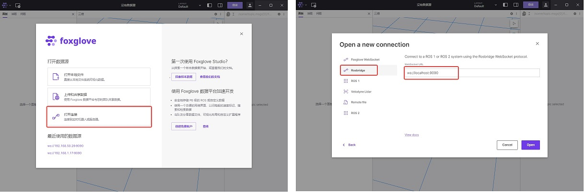

English| [简体中文](./README_cn.md)

# Function Introduction

oradar_lidar_ms200 package is used to connect the Oradar MS200 LiDAR sensor and send LiDAR data in ROS2 standard message format.

# Inventory

| Item Options    | List      | 
| ------- | ------------ | 
| RDK X3  | [Purchase Link](https://developer.horizon.ai/sunrise) | 
| Orbbec Astra Mini  | [Purchase Link](https://detail.tmall.com/item.htm?abbucket=4&id=706184556245&rn=079d616b9d44563c5768b03d2f9685c3&spm=a1z10.5-b-s.w4011-22651484606.62.47611e0b5uUKiZ&skuId=5137196470232) | 

# Usage

## Preparations

1. The Horizon RDK has been loaded with the Ubuntu 20.04 system image provided by Horizon.

2. Orbbec Astra Mini is correctly connected to RDK X3.

## Installing Orbbec Astra Mini Driver

Connect to RDK X3 via terminal or VNC, and execute the following commands

```bash
sudo apt update
sudo apt install -y tros-oradar-lidar-ms200
```

## Running Orbbec Astra Mini

In the RDK terminal, execute the following command to launch the MS200

```bash
source /opt/tros/setup.bash
ros2 launch oradar_lidar_ms200 ms200_scan.launch.py
```

## Viewing LiDAR Data

### Method 1 Command Line Way

Open a new terminal and enter the following command to view the LiDAR output data

```bash
source /opt/tros/setup.bash
ros2 topic echo /MS200/scan
```

### Method 2 Using foxglove Visualization

***Note: The device running Foxglove Studio should be on the same network segment as the RDK device***1. Visit the [official website](https://foxglove.dev/download) of Foxglove Studio and install it on your PC.

2. Open a new RDK terminal and enter the following command to install rosbridge

```bash
sudo apt install ros-foxy-rosbridge-suite
```

3. Run the following command to start rosbridge

```bash
source /opt/ros/setup.bash
ros2 launch rosbridge_server rosbridge_websocket_launch.xml
```

4. Open Foxglove Studio, select "Open Connection", choose rosbridge as the connection method in the upcoming dialog box, and enter the RDK's IP address instead of localhost.



5. In Foxglove Studio, click the "Settings" button in the top right corner, and in the panel that pops up on the left, configure the radar topic to be "visible". At this point, the studio will display real-time radar point data.


### Method 3: Visualization Using RVIZ

Install ROS2 on a PC or in an environment that supports RVIZ. Taking the example of the foxy version, run the following command:

```bash
source /opt/ros/foxy/setup.bash
ros2 run rviz2 rviz2
```

# Interface Description

## Topics

### Publishing Topics
| Topic           | Type                   | Description                                |
|-----------------|------------------------|--------------------------------------------|
| /MS200/scan     | sensor_msgs/LaserScan  | Two-dimensional laser scan data            |

## Parameters

| Parameter   | Data Type | Description                                |
|------------ |-----------|--------------------------------------------|
| frame_id    | string    | Name of the laser frame. Default is laser_frame |
| scan_topic  | string    | Name of the LaserScan topic. Default is scan    |
| port_name   | string    | Name of the laser port. Default is /dev/ttyACM0 |
| baudrate    | int       | Baud rate of the radar port. Default is 230400  |
| angle_min   | double    | Minimum angle in degrees, range [0, 360]. Default is 0 || angle_max   | double   | Maximum angle in degrees, with valid range [0, 360]. Default value is 360. |
   | range_min   | double   | Minimum distance in meters, with default value of 0.05.              |
   | range_max   | double   | Maximum distance in meters, with default value of 20.0.              |
   | clockwise    | bool     | Configure the direction of point cloud, true for clockwise and false for counterclockwise. Default is false. |
   | motor_speed | int      | Radar rotation speed in Hz, with valid range of 5 to 15Hz. Default value is 10Hz. |